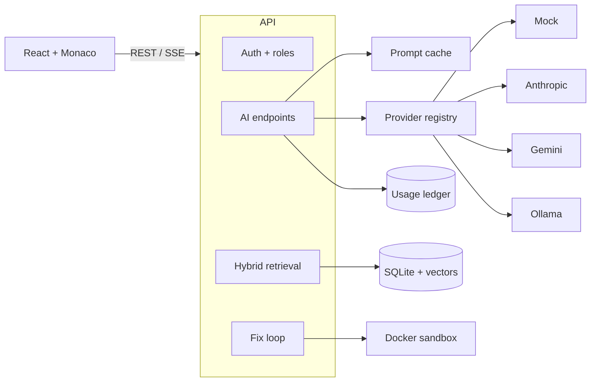

# AI Developer Collaboration Platform

[](https://github.com/Madhuuu7/Distributed-Cloud-IDE/actions/workflows/ci.yml)
[](LICENSE)
[](https://www.python.org/)
[](https://react.dev/)
[](https://fastapi.tiangolo.com/)

A shared workspace where a development team and an AI teammate work on the same
codebase. Projects live in workspaces with real roles, the assistant has read
the code and cites it, and when it proposes a fix it runs the tests before
claiming the fix works.

Built on a browser IDE with Monaco and a hardened Docker sandbox.

> **Live demo:** _add the URL after your first Render deploy._ The demo runs on
> the mock AI provider and with code execution switched off - see
> [Deployment](#deployment) for why, and run it locally for the full thing.

## Screenshots

| | |
|---|---|
| _Add `docs/images/ide.png`_ | _Add `docs/images/usage.png`_ |
| The IDE with the assistant panel: a grounded answer with clickable citations | The usage dashboard: spend, cache hit rate, and per-feature breakdown |

## What is actually interesting here

Most "AI coding assistant" projects are a text box in front of a chat
completion. These are the parts that are not:

**The AI runs its own patches.** A fix run proposes a change, executes the
project's tests inside the sandbox, reads the real failure output, and tries
again. It never writes to your files - it ends holding a diff and a human
approves it.

**It runs with no API key.** The default provider generates correctly shaped
responses locally and produces hashed n-gram embeddings that carry genuine
lexical signal. Retrieval, streaming, caching, rate limiting and cost
accounting all execute for real. Only the quality of the prose is fake, so the
entire application - and all 87 tests - run at zero cost.

**Retrieval chunks on structure, not line count.** Python and JavaScript
sources split on function and class boundaries, so a retrieved chunk is a whole
function that knows its own name. Ranking blends IDF-weighted keyword overlap
with cosine similarity, and both component scores come back in the response so
a surprising result can be explained rather than argued with.

**Every model call is metered.** Provider, model, tokens, latency, cost and
cache-hit are recorded per call, including cache hits - which is what makes the
savings figure on `/ai/usage` mean anything.

## Stack

**Frontend** React, Vite, TypeScript, Tailwind CSS, React Router, Axios,
Monaco Editor

**Backend** FastAPI, SQLAlchemy 2.0, SQLite, JWT, Pydantic, NumPy, Docker SDK

**AI** Provider abstraction over Anthropic (Claude), Google Gemini, Ollama, and
a local mock. Hybrid retrieval over embeddings stored as packed `float32`.

## Architecture



## Authorisation

Three roles, strictly ordered. A project is reachable if you own it **or** you
are a member of its workspace.

| Role | Read | Write | Run code | Use AI | Manage members |
|---|---|---|---|---|---|
| `viewer` | yes | no | no | yes | no |
| `editor` | yes | yes | yes | yes | no |
| `owner` | yes | yes | yes | yes | yes |

Two rules the code holds to everywhere:

- **`404` for anything you cannot see**, whether or not it exists. Returning
  `403` would confirm a resource's existence to someone with no access to it.
- **`403` only once you are already a member** whose role is too low. You
  already know the resource exists, so naming the real reason leaks nothing.

## Security model

**Authentication.** Every endpoint except `/health`, `/auth/login`, and
`/auth/signup` requires a bearer token.

**Code execution.** Each run gets a fresh container that is destroyed
afterwards:

| Control | Setting |
|---|---|
| Network | disabled entirely |
| Root filesystem | read-only, with a 32 MB `tmpfs` at `/tmp` |
| User | `65534:65534` (unprivileged) |
| Capabilities | all dropped, `no-new-privileges` |
| Memory | 256 MB, swap disabled |
| CPU | 0.5 cores |
| Processes | 64 PID ceiling |
| Wall clock | 10 s, then killed |
| Output | truncated at 64 KB |

File names written into the sandbox are path-flattened, which matters more now
that some of them come from model output.

**AI spend.** A per-user rate limit, a hard iteration ceiling on fix runs, and
a content-addressed prompt cache. An AI endpoint with no limit in front of a
metered API is an unbounded bill waiting for a retry loop.

`EXECUTION_BACKEND=local` replaces the container with a bare subprocess. That
path has **no isolation** and exists only so the app runs without a Docker
daemon. The API logs a warning at startup when it is active.

> The API talks to the Docker socket directly to spawn sibling containers,
> which grants it host-level Docker control. Fine for local development; in
> production, execution belongs in a separate worker behind a queue.

## Getting started

Copy `.env.example` to `.env` and set a real `SECRET_KEY`. Everything else has
a working default - `AI_PROVIDER=mock` means you need no API key to start.

### Backend

```bash
python -m venv .venv
source .venv/bin/activate  # Windows: .venv\Scripts\activate
pip install -r server/requirements.txt

cd server
uvicorn app.main:app --reload --port 8000
```

Interactive API docs: <http://localhost:8000/docs>

Runtime images are pulled on first use. Pre-pull them to skip the wait:

```bash
docker pull python:3.12-slim
docker pull node:20-alpine
```

### Frontend

```bash
cd client
npm install
npm run dev
```

### Everything at once

```bash
docker compose up --build
```

### Using a real model

```bash
AI_PROVIDER=anthropic ANTHROPIC_API_KEY=sk-ant-...
# Anthropic has no embeddings endpoint, so pick one separately:
AI_EMBEDDING_PROVIDER=gemini GEMINI_API_KEY=...
```

Or keep everything on your own machine, which is the only configuration where
source code never leaves it:

```bash
AI_PROVIDER=ollama AI_EMBEDDING_PROVIDER=ollama
ollama pull llama3.1 && ollama pull nomic-embed-text
```

## Deployment

`render.yaml` is a Render blueprint that deploys both services. Push this repo
to GitHub, then **New → Blueprint** on Render and point it at the repo. After
the first deploy, set the two URLs that cannot be known until both services
exist: `CORS_ORIGINS` on the API (the static site's URL) and `VITE_API_URL` on
the client (the API's URL).

`SECRET_KEY` is generated by Render and never appears in the repo. The
production guard in `app/core/config.py` refuses to start without a real one,
so a forgotten key fails the deploy instead of shipping a forgeable JWT.

**What the hosted demo cannot do, and why.** Render provides no Docker daemon.
The only way to run user-submitted code there would be a bare subprocess on the
web host, which on a public URL is remote code execution as a service. So the
deployment sets `EXECUTION_BACKEND=disabled`: **Run** and fix runs return a
`503` that explains itself, and everything else - workspaces, indexing, search,
chat, review, the usage dashboard - works. Clone and run locally for the
sandbox.

Three more free-tier facts worth knowing before you judge the demo:

- The API sleeps after 15 minutes idle, so the first request after a quiet spell
  takes roughly 50 seconds.
- There is no persistent disk, so the SQLite database resets on every deploy and
  every cold start. `DB_PATH=/tmp/app.db` makes that explicit rather than
  looking like storage that silently is not.
- `AI_PROVIDER=mock` by default: the demo costs nothing to run. Set
  `AI_PROVIDER=anthropic` and `ANTHROPIC_API_KEY` in the Render dashboard for
  real answers.

## Tests

```bash
cd server
pip install -r requirements-dev.txt
pytest
```

93 tests, all runnable without a Docker daemon and without an API key. They
cover authentication, cross-user isolation, role boundaries, the sandbox
arguments themselves (loosening a flag fails a test), index staleness, cache
behaviour, hallucinated-citation filtering, the rate limiter, the production
startup guards, and the fix loop driven by a scripted model.

CI runs them on every push, along with a frontend typecheck and build and a
check that `docs/api/openapi.json` still matches what the app serves - a stale
contract is worse than no contract.

To exercise the real sandbox end to end:

```bash
EXECUTION_BACKEND=docker pytest tests/test_execution.py
```

## API

The contract is `docs/api/ai-collab-contract.md`; `docs/api/openapi.json` is
generated from the app. A Postman collection with 60 assertions -
including the `404`-not-`403` rule and the viewer `403` - is in
`docs/api/postman/`.

| Method | Path | Notes |
|---|---|---|
| `POST` | `/auth/signup` `/auth/login` | Returns a bearer token |
| `GET` | `/auth/me` | Current user |
| `GET` `POST` | `/workspaces` | Creator becomes owner |
| `GET` `DELETE` | `/workspaces/{id}` | Deleting returns projects to their owners |
| `GET` `POST` | `/workspaces/{id}/members` | Invite by email |
| `PATCH` `DELETE` | `/workspaces/{id}/members/{user_id}` | Cannot strand a workspace without an owner |
| `GET` `POST` | `/workspaces/{id}/messages` | Room chat, optionally anchored to a line |
| `GET` `POST` | `/projects` | Accepts an optional `workspace_id` |
| `GET` `DELETE` | `/projects/{id}` | |
| `GET` `POST` | `/projects/{id}/files` | Language inferred from the extension |
| `GET` `PUT` `DELETE` | `/projects/file/{id}` | Writing needs `editor` |
| `POST` `GET` `DELETE` | `/projects/{id}/index` | Build, inspect, or drop the embedding index |
| `POST` | `/search` | Hybrid search with both component scores |
| `GET` | `/ai/providers` | What is configured and what is active |
| `POST` | `/ai/chat` | Grounded answer with citations |
| `POST` | `/ai/chat/stream` | Same, as Server-Sent Events |
| `GET` `DELETE` | `/ai/conversations/{id}` | |
| `POST` | `/ai/explain` | Explain a file or a selection |
| `POST` | `/ai/review` | Inline findings anchored to real lines |
| `GET` | `/ai/usage` | Tokens, cost, cache hit rate, savings |
| `POST` `GET` | `/fix-runs` | Start or list agentic fix runs |
| `GET` | `/fix-runs/{id}` | Every iteration, plus the proposed diff |
| `POST` | `/fix-runs/{id}/apply` | Write the approved patch |
| `POST` | `/fix-runs/{id}/cancel` | |
| `GET` | `/execute/languages` | Supported runtimes |
| `POST` | `/execute` | stdout, stderr, exit code, duration |
| `GET` | `/health` | Public |

## Known limitations

Stated rather than hidden, because each one is a deliberate trade:

- **The prompt cache and rate limiter are in-process.** Run two API workers and
  each keeps its own. Both are behind narrow interfaces so Redis drops in.
- **Vector search scores every chunk in NumPy.** Honest to a few thousand
  chunks. `VectorStore` exists so pgvector can replace it without touching the
  ranking code.
- **Chunking is regex-based, not a real parser.** No build step and no native
  dependency, and it degrades to line windows rather than failing. A malformed
  file gets slightly worse chunks, never an exception.
- **The mock provider's embeddings are lexical, not semantic.** `car` and
  `automobile` stay far apart. Good enough to exercise and measure the
  pipeline; switch providers before claiming otherwise.
- **The sandbox has no network**, so nothing can be `pip install`ed into it and
  `pytest` is not in the base image. Fix runs default to `unittest discover`,
  which ships with the standard library.
- **There are no frontend tests.** The UI was verified by driving a real browser
  - which is how two bugs were found - but that check is not repeatable in CI.
  Vitest plus a few Playwright specs is the gap.

## Roadmap

Built: authentication, workspaces and roles, project and file management,
Monaco editor, sandboxed Python and JavaScript execution, provider abstraction
with caching and cost accounting, structural chunking and hybrid retrieval,
grounded chat with citations and SSE streaming, AI explain and review, the
agentic fix loop, and the usage dashboard.

Next: real-time collaborative editing over WebSockets (Yjs CRDT with presence
cursors), xterm.js interactive terminal, GitHub OAuth with repository import
and PR creation, a daily standup digest, PostgreSQL with pgvector, Redis for
the cache and cross-worker fan-out, frontend tests, and an eval harness scoring
retrieval against a golden question set.

## License

MIT - see [LICENSE](LICENSE).
